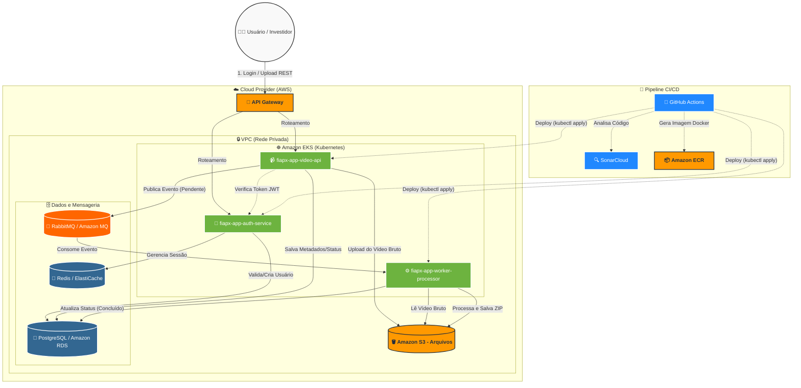

# 🏗️ Solução FIAP X - Sistema de Processamento de Vídeos

Esta documentação descreve a arquitetura completa da solução desenvolvida para o **Hackathon FIAP X**. O sistema foi projetado seguindo os princípios de microsserviços, orientação a eventos e escalabilidade em nuvem.

## 📐 Desenho da Arquitetura

---

## 🚀 Componentes da Solução

### 1. Microsserviços
*   **`fiapx-app-auth-service`**: Gerencia a segurança, autenticação e autorização utilizando **JWT**.
*   **`fiapx-app-video-api`**: Interface principal para upload de vídeos e consulta de status de processamento.
*   **`fiapx-app-worker-processor`**: Worker assíncrono que realiza o processamento pesado de vídeos (extração de imagens e compactação ZIP).

### 2. Infraestrutura e Persistência
*   **Amazon EKS (Kubernetes)**: Orquestração de containers com auto-scaling.
*   **RabbitMQ**: Broker de mensageria para desacoplamento e resiliência.
*   **PostgreSQL**: Persistência de dados relacionais e controle de status.
*   **Redis**: Cache e gerenciamento de sessões de segurança.
*   **Amazon S3**: Armazenamento de arquivos binários (vídeos e ZIPs resultantes).
*   **API Gateway**: Ponto de entrada seguro com VPC Link.

---

## 🔄 Fluxo de Funcionamento

1.  **Autenticação**: O usuário obtém um token JWT no serviço de Auth.
2.  **Upload**: O vídeo é enviado para a Video API, que o armazena e registra o status inicial.
3.  **Mensageria**: Um evento é publicado no RabbitMQ para processamento assíncrono.
4.  **Processamento**: O Worker consome a mensagem, processa o vídeo e gera o arquivo final.
5.  **Finalização**: O status é atualizado e o usuário pode baixar o resultado.

---

## 🛠️ Stack Tecnológica

| Categoria | Tecnologia |
| :--- | :--- |
| **Linguagem** | Java 17 |
| **Framework** | Spring Boot 3 |
| **Cloud** | AWS |
| **Mensageria** | RabbitMQ |
| **Containers** | Docker / Kubernetes |
| **Qualidade** | SonarCloud |
| **CI/CD** | GitHub Actions |

---
*Este projeto faz parte do desafio Hackathon FIAP X - Software Architecture.*
